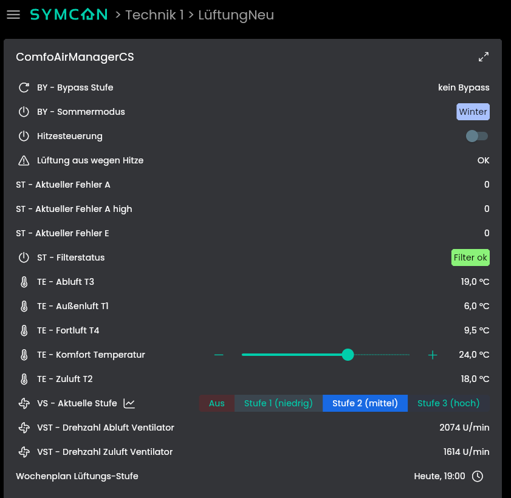
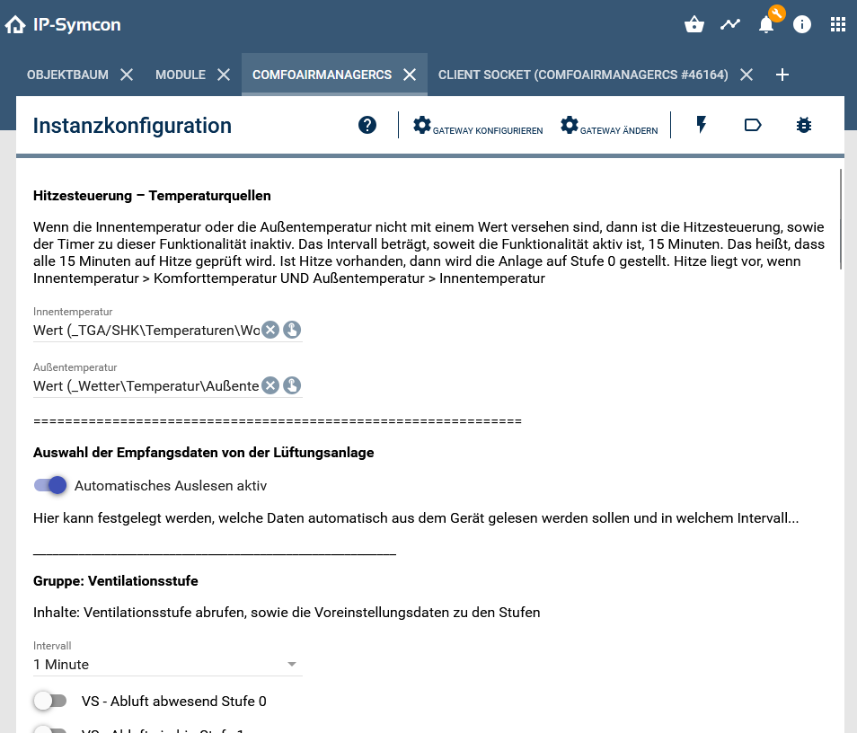
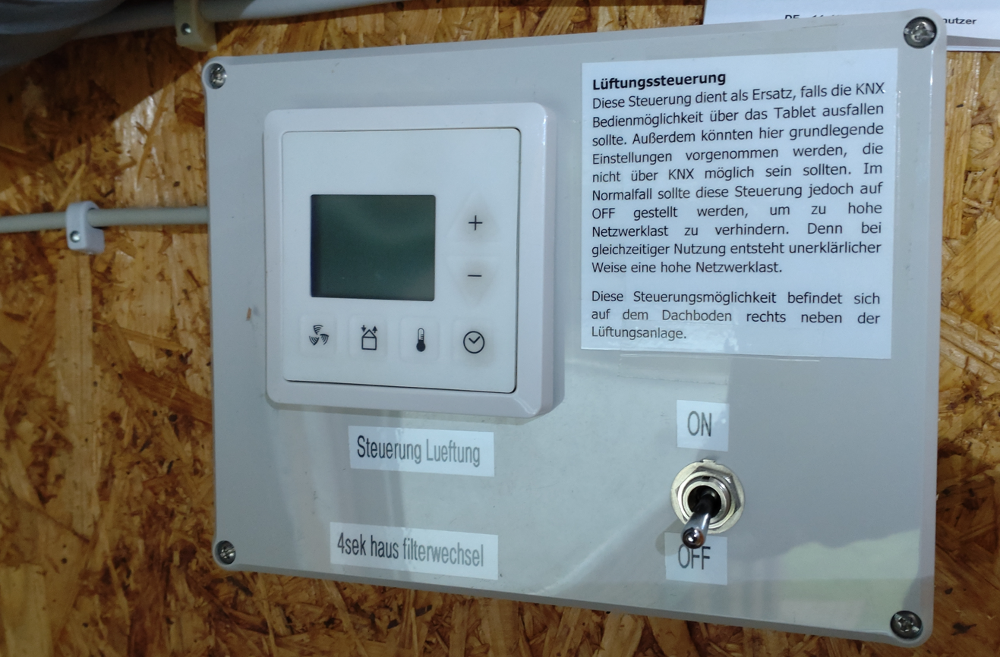
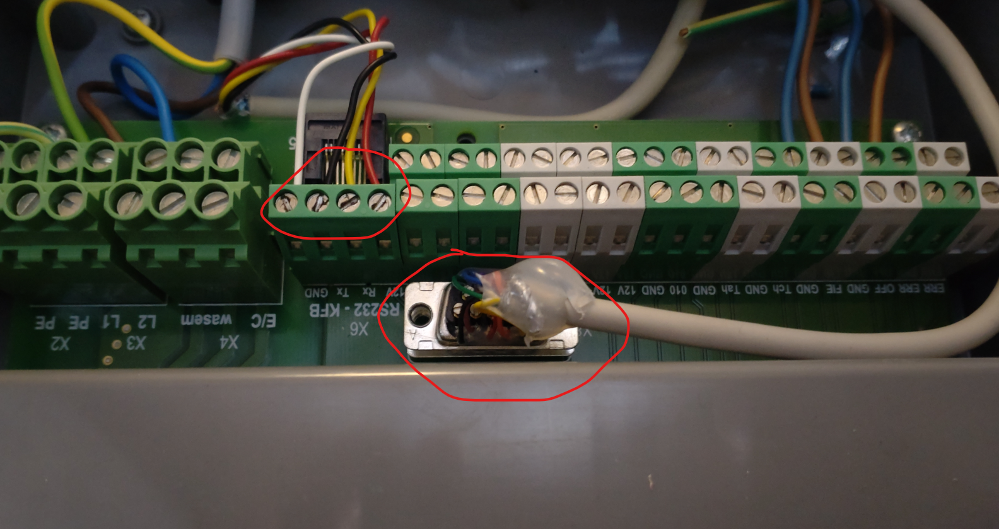
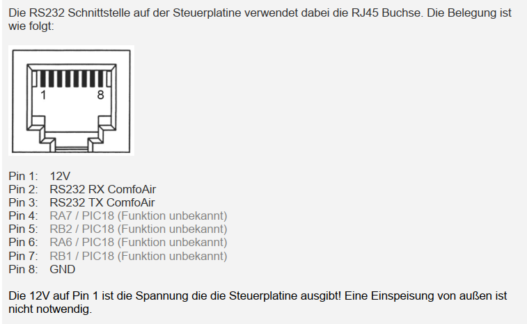
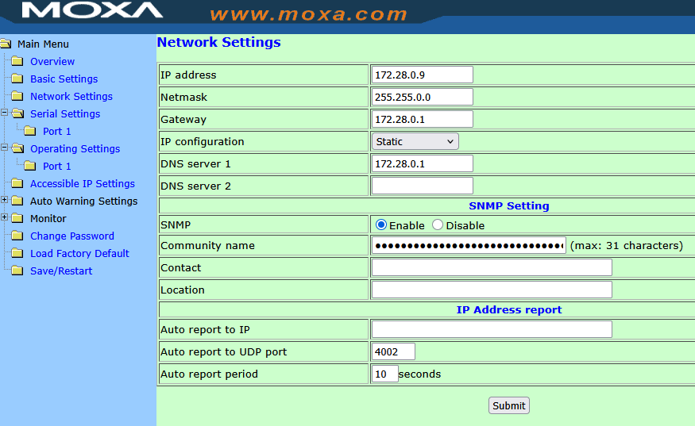
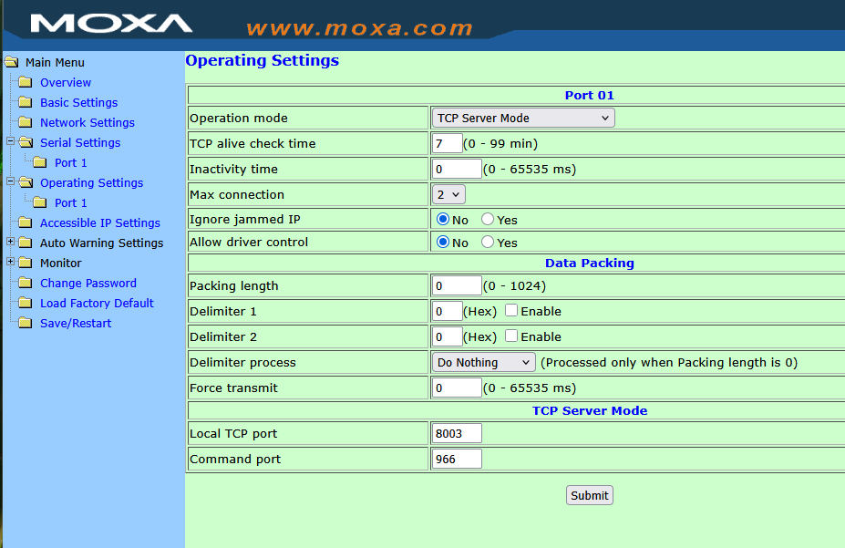

# ComfoAirManager

[](https://www.symcon.de)


IP-Symcon-Modul zur Steuerung und Überwachung von **ComfoAir Lüftungsanlagen**.  
Das Modul ermöglicht unter anderem das Auslesen von Sensorwerten, die Steuerung der Lüftungsstufen, eine automatische Hitzesteuerung, die Nutzung von Wochenplänen sowie die Auswertung von Bypass- und Sommermodusstatus. Darüber hinaus werden Betriebsstunden, Filter- und Fehlerzustände erfasst und dargestellt.

Die Vielzahl an Datenpunkten, die von der Lüftungsanlage bereitgestellt werden können, wird zukünftig weiter im Modul implementiert. Die wichtigsten Funktionen und Abfragedaten sind jedoch bereits enthalten. Grundlage für die Arbeitsweise dieses Moduls ist die Protokollbeschreibung von **see-solution** (Stand: 25.12.2012). An dieser Stelle ein ausdrückliches Dankeschön für die veröffentlichten Protokolldaten – ohne diese wäre die Umsetzung dieses Moduls in dieser Form nicht möglich gewesen. Laut see-solution lassen sich mit diesem Protokoll zudem auch Geräte der Hersteller **StorkAir**, **Werning** und **Santos** ansprechen.

Ebenso gilt mein Dank den Gemeinschaften der **IP-Symcon Community** sowie dem **Haustechnikdialog**, deren Diskussionen und Beiträge eine große Inspiration waren, sich intensiver mit diesem Thema zu beschäftigen:

- https://community.symcon.de/t/zehnder-comfoair-350-ueber-rs232-anbinden/26374/6

- https://www.haustechnikdialog.de/Forum/t/108357/Steuerung-der-ComfoAir-ueber-PC

- http://www.see-solutions.de/sonstiges/sonstiges.htm#Zehnder

Mit Version 0.2 ist dieses Modul in Symcon zukunftsfähig bereits jetzt mit "IPSModuleStrict" ausgestattet. Dies stellt sicher, dass PHP Version >9.0 im Backend verwendet werden kann. Dies jedoch führt dazu, dass mindestens die Symcon Version 8.1 als Plattform verwendet wird.

### Zunächst die Frage: Warum?

Viele der älteren ComfoAir-Anlagen lassen sich nicht ohne Weiteres in eine moderne Hausautomation integrieren. Laut Hersteller ist es bei diesen Geräten nicht möglich, die heute bei neueren Anlagen üblichen Umsetzer oder Gateways nachzurüsten – selbst nicht gegen Aufpreis. Genau daraus entstand der Anreiz, eine eigene Lösung zu entwickeln.

In der Vergangenheit habe ich über viele Jahre hinweg klassische PHP-Skripte in IP-Symcon eingesetzt, um verschiedene Aufgaben zu lösen – unter anderem auch zur Anbindung der Lüftungsanlage. Mit zunehmendem Funktionsumfang reichte dieser Ansatz jedoch nicht mehr aus. Der bestehende Code zeigte an mehreren Stellen Schwächen, sodass ich mich bewusst dazu entschieden habe, ein **robustes, strukturiertes und erweiterbares Modul** zu entwickeln.

Bei der Modulentwicklung wurde besonderer Wert auf die **Zuverlässigkeit des Datenstroms** gelegt. Schreibkommandos werden gezielt auf ihr Antwortverhalten überwacht und bei Zeitüberschreitungen automatisch bis zu drei Mal erneut gesendet. Die bisherigen Tests zeigen, dass dieses Vorgehen zuverlässig funktioniert und die in IP-Symcon angezeigten Zustände – insbesondere die aktuelle Lüftungsstufe – konsistent und korrekt bleiben.

Das Modul kann ab Version 0.2 über zwei unterschiedliche Gateways angebunden werden:

- für den Betrieb über ein *Client Socket*

- für den Betrieb über einen *Serial Port*

Die Standardanbindung ab Symcon Version 8.1 erfolgt über den **Client Socket**. Dieser arbeitet TCP/IP-basiert, sodass die Lüftungsanlage über einen geeigneten Umsetzer in das hausinterne Netzwerk eingebunden werden kann. Weitere Details dazu folgen in den nachfolgenden Abschnitten der Dokumentation. 

### Inhaltsverzeichnis

1. [Vorwort](#1-vorwort)
2. [Funktionsumfang](#2-funktionsumfang)
3. [Voraussetzungen](#3-voraussetzungen)
4. [Hardwareanschluss](#4-hardwareanschluss)
5. [Software-Installation](#5-software-installation)
6. [Einrichten der Instanzen in IP-Symcon](#6-einrichten-der-instanzen-in-ip-symcon)
7. [Statusvariablen und Profile](#7-statusvariablen-und-profile)
8. [Visualisierung](#8-visualisierung)
9. [PHP-Befehlsreferenz](#9-php-befehlsreferenz)
10. [Lizenz-Haftung](#10-lizenz-haftung)
11. [Screenshots](#11-screenshots)

### 1. Vorwort

Kurze Erläuterung dazu wie ich meine eigene Lüftungsanlage eingestellt habe und warum ich das so gemacht habe. Diese Vorgehensweise spiegelt sich in der Modulkonfiguration wieder. Wenn die Lüftungsanlage mit der CC Luxe oder CC Ease (im Folgenden Fernbedienung) betrieben wird, dann hat man die Möglichkeit zwischen Automatik, Stufe 0, Stufe 1, Stufe 2, und Stufe 3 zu wählen. Die Stufe Automatik arbeitet ein in der Fernbedienung hinterlegtes Kalenderprogramm ab. Nutzt man die Steuerung nun über die Symcon, dann muss man umdenken. Ich empfehle die Anlage entweder nur mit Fernbedienung oder nur mit Symcon zu betreiben, aber nicht mit beidem. Schließt man beides gleichzeitig an der Lüftungsanlage an, dann kann es zu Problemen kommen. Außerdem wird im Falle des Anschlusses der Fernbedienung das Netzwerk mit unzähligen Daten überfrachtet, die die Symcon auswerten muss. Um einen Hitzeschutz (und später Schutz vor zu trockener Luft) zu realisieren muss die Anlage "aus" geschaltet werden können (oder so gut wie). In der Lüftungsanlage ist jedoch kein "Aus" realisiert. Die kann nur über Umwege erreicht werden. Daher habe ich meine Stufen wie folgt eingestellt:Im Folgenden möchte ich kurz erläutern, wie ich meine eigene Lüftungsanlage konfiguriert habe und aus welchen Gründen diese Einstellungen gewählt wurden. Diese Vorgehensweise spiegelt sich direkt in der Konzeption und Konfiguration des Moduls wider.

Wird eine ComfoAir-Anlage über eine **CC Luxe** oder **CC Ease** (im Folgenden *Fernbedienung* genannt) betrieben, stehen dort die Betriebsarten **Aus**, **Stufe 0**, **Stufe 1**, **Stufe 2** und **Stufe 3** zur Verfügung. Die Betriebsart *Automatik* arbeitet dabei ein in der Fernbedienung hinterlegtes Kalender- bzw. Zeitprogramm ab. Im Modul spielt die eingebaute Automatikfunktion keine Rolle.

Wird die Steuerung hingegen über **IP-Symcon** realisiert, ist ein Umdenken erforderlich. Ich empfehle ausdrücklich, die Lüftungsanlage entweder **ausschließlich über die Fernbedienung** oder **ausschließlich über Symcon** zu betreiben – jedoch nicht parallel über beide Systeme. Werden Fernbedienung und Symcon gleichzeitig an der Anlage betrieben, kann es zu unerwartetem Verhalten kommen. Zusätzlich erzeugt die angeschlossene Fernbedienung eine sehr große Menge an Kommunikationsdaten, die von Symcon empfangen und ausgewertet werden müssen, was unnötige Last verursacht.

Um Funktionen wie einen **Hitzeschutz** (und perspektivisch auch einen Schutz vor zu trockener Luft) sinnvoll umsetzen zu können, ist es notwendig, die Lüftungsanlage faktisch „abschalten“ zu können – oder zumindest auf ein Minimum zu reduzieren. Ein echtes **„Aus“** ist in der Lüftungsanlage jedoch nicht vorgesehen und kann nur über entsprechende Umgehungslösungen realisiert werden.

Aus diesem Grund habe ich die Lüftungsstufen bewusst angepasst und wie folgt konfiguriert:

| Submenü | Stufe   | Art    | Regelungsmenge |
| ------- | ------- | ------ | -------------- |
| P30     | Stufe 0 | Abluft | 0%             |
| P31     | Stufe 1 | Abluft | 20%            |
| P32     | Stufe 2 | Abluft | 65%            |
| P33     | Stufe 3 | Abluft | 100%           |
| P34     | Stufe 0 | Zuluft | 0%             |
| P35     | Stufe 1 | Zuluft | 16%            |
| P36     | Stufe 2 | Zuluft | 50%            |
| P37     | Stufe 3 | Zuluft | 96%            |

Ist eine Stufe **„0“** nicht direkt einstellbar, sollte diese so niedrig wie technisch möglich konfiguriert werden. Dabei ist zu beachten, dass die **Abluftleistung im Betrieb stets etwas höher sein sollte als die Zuluftleistung**. Dadurch entsteht ein leichter Unterdruck im Gebäude. Über vorhandene Undichtigkeiten in der Gebäudehülle wird so kalte Außenluft nachgezogen, während gleichzeitig verhindert wird, dass warme, feuchte Innenluft nach außen gedrückt wird. Letzteres könnte bei sinkenden Außentemperaturen innerhalb der Bauteile kondensieren und langfristig die **Schimmelbildung begünstigen**. Der leichte Unterdruck wirkt diesem Effekt entgegen.

Durch diese Konfiguration ergibt sich über das im Modul hinterlegte Profil der Variable **„Aktuelle Stufe“** eine Auswahl der Betriebsarten **„Aus“**, **„Stufe 1 (niedrig)“**, **„Stufe 2 (mittel)“** und **„Stufe 3 (hoch)“**. Auf diese Weise lässt sich die Lüftungsanlage nahezu abschalten, was unter anderem hilfreich ist, wenn im Außenbereich gespritzt wird oder landwirtschaftliche Arbeiten wie Güllefahren stattfinden.

Persönlich nutze ich **Stufe 1** nachts oder bei längerer Abwesenheit, **Stufe 2** im normalen Tagesbetrieb und **Stufe 3** ein- bis zweimal täglich zum gezielten „Durchlüften“. Zusätzlich eignet sich Stufe 3 sehr gut zum kurzfristigen Entlüften beim Kochen oder Duschen.

Über die üblichen Mechanismen von IP-Symcon können dem Modul weitere Bedienelemente wie Taster, Schalter oder Logiken zugeordnet werden, um die einzelnen Stufen auch extern oder automatisiert anzusteuern. Diese Betriebsweise hat sich bei mir über viele Jahre hinweg bewährt.

Die beschriebenen Grundeinstellungen wurden bisher ausschließlich über die Fernbedienung vorgenommen, was in der Regel auch nur einmal erforderlich ist. Perspektivisch ist geplant, das Modul so zu erweitern, dass diese grundlegenden Einstellungen künftig ebenfalls direkt über das Modul vorgenommen werden können.

### 2. Funktionsumfang

* Automatisches Auslesen von Ventilationsstufen, Temperaturen, Bypass-Status, Störungen, Betriebsstunden und Vorheizung
* Wochenplan für Lüftungsstufen
* Hitzesteuerung (Stoppt Lüftung bei zu hoher Temperatur)
* Steuerung von Ventilationsstufen, Komforttemperatur und Setpoints
* Verwaltung von Statusvariablen und IPS-Profilen
* Unterstützt automatische Abfrageintervalle (AutoRead)
* Integration in WebFront über Statusvariablen und Profile

### 3. Voraussetzungen

- IP-Symcon ab Version 8.1 ist die Gatewayzuordnung manuell zu treffen
- IP-Symcon ab Version 8.2 ist die Gatewayzuordnung vereinfacht über ein Auswahldialog möglich
- Anschluss der Lüftungsanlage an das Netzwerk oder an den Server der IP-Symcon

### 4. Hardwareanschluss

Die Lüftungsanlage kann entweder **direkt über den seriellen Port** mit dem IP-Symcon-Server verbunden werden oder alternativ über einen **seriell-zu-Netzwerk-Umsetzer** (z. B. von Moxa) in das vorhandene Netzwerk eingebunden werden. Deutlich flexibler ist dabei die Variante mit einem Umsetzer, da sich die Lüftungsanlage in der Praxis nur selten in unmittelbarer Nähe zum Symcon-Server befindet.

**Wichtiger Hinweis zur Umsetzung:**  
Für die nachfolgend beschriebenen Arbeiten wird empfohlen, eine **Elektrofachkraft hinzuzuziehen**, da der Steuerungskasten der Lüftungsanlage geöffnet werden muss, um den seriellen Anschluss herzustellen. Wie bereits in den Lizenzbedingungen beschrieben, weise ich an dieser Stelle nochmals ausdrücklich darauf hin, dass **keinerlei Haftung oder Gewährleistung** für mögliche Schäden übernommen wird. Die Umsetzung erfolgt ausschließlich **in eigener Verantwortung des Betreibers**.

Wie bereits zuvor erwähnt, empfehle ich, die Fernbedienungen **CC Ease** bzw. **CC Lux** **nicht parallel** zum Betrieb über IP-Symcon zu verwenden. Ein gleichzeitiger Betrieb kann zu unerwünschten Effekten im Ablauf führen und erzeugt zudem unnötig große Datenmengen, die von Symcon verarbeitet werden müssten.  
Um dennoch jederzeit die Möglichkeit zu haben, Grundeinstellungen vorzunehmen oder die Anlage auch bei einem Ausfall von Symcon bedienen zu können, empfiehlt sich der Einbau eines **Umschalters**. Im Handel sind sogenannte **Vollumschalter** erhältlich, die vier Adern gleichzeitig umschalten oder trennen können. Auf diese Weise lässt sich die Fernbedienung bei Bedarf jederzeit wieder aktivieren. Alternativ kann auch einfach der **grüne Reihenstecker** an der Fernbedienung abgezogen werden. In diesem Fall muss die Fernbedienung an der Lüftungsanlage selbst nicht abgeklemmt werden. Meine persönliche Umsetzung ist in den weiter unten gezeigten Screenshots zu erkennen.

Im Steuerungskasten der Lüftungsanlage befindet sich ein **serieller Anschluss** (siehe Screenshots), an den der Moxa-Umsetzer direkt angeschlossen werden kann. Ein passendes Anschlusskabel ist im Fachhandel erhältlich. In der Regel ist hierfür **keine Umkonfiguration des Kabels notwendig**. Sollte dennoch eine Anpassung erforderlich sein, ist die entsprechende Aderbelegung in den Screenshots dokumentiert. Diese stammen aus der Protokollbeschreibung von **see-solution**.

Der verwendete Umsetzer (in meinem Fall ein **Moxa NPort 5110 Serial Device Server**) wird über das serielle Anschlusskabel direkt mit der Lüftungsanlage verbunden. Der Moxa-Umsetzer stellt anschließend die Verbindung zum **eigenen IP-Netzwerk** her. Dies kann entweder über einen kabelgebundenen Netzwerkanschluss oder auch über ein WLAN-Gerät erfolgen, abhängig vom jeweiligen Netzwerkaufbau. Entscheidend ist lediglich, dass eine stabile Netzwerkverbindung zwischen dem Moxa-Umsetzer und dem IP-Symcon-Server besteht.

Nach der Anmeldung am Moxa-Umsetzer (Details hierzu sind der Moxa-Dokumentation zu entnehmen) müssen zunächst die **Netzwerkeinstellungen** vorgenommen werden. Es wird dringend empfohlen, dem Umsetzer eine **statische IP-Adresse** zuzuweisen. Die IP-Adressdaten sind entsprechend dem eigenen Netzwerk anzupassen. Die in den Screenshots gezeigten Werte dienen lediglich als Beispiel und sollten **nicht ungeprüft übernommen** werden.

Damit der Moxa korrekt mit der Lüftungsanlage kommunizieren kann, müssen außerdem die **seriellen Schnittstellenparameter** passend eingestellt werden. Dazu zählen insbesondere **Baudrate**, **Datenbits** und **Stopbits**, die exakt gemäß den Screenshots zu übernehmen sind.  
Weitere wichtige Einstellungen finden sich im Bereich **Operating Settings**. Hier muss der Moxa als **Server** konfiguriert sein. Die dort gezeigten Parameter sollten **1:1 übernommen** werden. Besonders wichtig ist dabei der **Local Port 8003**, da dieser später zusammen mit der IP-Adresse des Moxa-Umsetzers in der IP-Symcon-I/O-Instanz hinterlegt werden muss.

### 5. Software-Installation

* Unter "Kern Instanzen" in der Symcon-Konsole das Modul "Module" öffnen. Dann unten rechts auf dem großen + klicken. Darin die Modul Url eingeben: https://github.com/BugForgeNerd/ComfoAirManager
  Anschließend im Symcon Objektbaum an beliebiger Stelle auf eine Kategorie rechts-klick "Objekt hinzufügen" und dann Instanz wählen. Dort dann im Schnellfilter "ComfoAirManager"" raussuchen. Die I/O Instanz wird bei der Installation abgefragt. Dazu folgend mehr.
* Über den Module Store das 'ComfoAirManager'-Modul installieren. (kommt später)`

### 6. Einrichten der Instanzen in IP-Symcon

Unter 'Instanz hinzufügen' kann das 'ComfoAirManager'-Modul mithilfe des Schnellfilters gefunden werden. Die I/O Instanz stellt dem Modul die Datenschnittstelle zur Verfügung. Im Falle eines Clientsockets muss die Host IP des Umsetzers (bei mir ein Moxa-Modul) und dessen Port angegeben werden. Ab Symcon Version 8.1 muss das Modul als Client-Socket oder Serial Port manuell eingebunden werden. Ab Symcon Version 8.2 werden die zwei vorgenannten Einbindungsmöglichkeiten in einem Auswahldialog vorgeschlagen.

- Weitere Informationen zum Hinzufügen von Instanzen in der [Dokumentation der Instanzen](https://www.symcon.de/service/dokumentation/konzepte/instanzen/#Instanz_hinzufügen)

__Konfigurationsseite__:

| Name             | Beschreibung                                             |
| ---------------- | -------------------------------------------------------- |
| InsideTempVarID  | Auswahl der Innentemperatur-Variable für Hitzesteuerung  |
| OutsideTempVarID | Auswahl der Außentemperatur-Variable für Hitzesteuerung  |
| AutoReadEnabled  | Aktiviert das automatische Auslesen der Gerätedaten      |
| AutoReadInterval | Intervall für die Abfrage der jeweiligen Command-Gruppen |

---

Die **Hitzesteuerung** kann optional genutzt werden. Sind die beiden erforderlichen **Temperaturvariablen** nicht zugewiesen, ist die Hitzesteuerung automatisch inaktiv, da sie ohne diese Werte nicht funktionieren kann. Auch bei korrekt zugewiesenen Variablen lässt sich die Hitzesteuerung jederzeit über die Variable **„Hitzesteuerung“** im IP-Symcon-Objektbaum manuell ein- oder ausschalten.

Im aktiven Betrieb signalisiert die Statusvariable **„Lüftung aus wegen Hitze“**, ob die Hitzesteuerung eine Übertemperatur erkannt und die Lüftungsanlage entsprechend abgeschaltet bzw. stark reduziert hat. So ist jederzeit nachvollziehbar, ob ein Eingriff durch die Hitzesteuerung erfolgt ist.

Über die Checkbox **„Automatisches Auslesen aktiv“** kann global festgelegt werden, ob die nachfolgenden Datenabfragegruppen ausgeführt werden sollen. Diese Funktion dient als zentraler Schalter, um sämtliche automatischen Abfragen temporär zu deaktivieren, ohne die individuell konfigurierten Abfrageintervalle der einzelnen Gruppen zu verlieren oder neu einstellen zu müssen.

Die aus der Lüftungsanlage auslesbaren Informationen sind in mehrere **Gruppen** unterteilt, wobei jede Gruppe ihre Daten in einer gemeinsamen Abfrage ermittelt. Über die jeweiligen Checkboxen kann festgelegt werden, welche Daten als **Statusvariablen** unterhalb des Moduls in IP-Symcon angezeigt werden sollen. Ist für eine Gruppe ein Intervall definiert, werden die entsprechenden Daten regelmäßig und automatisch von der Lüftungsanlage abgefragt.

Einige Variablen sind bereits bei der **Installation des Moduls standardmäßig aktiviert**. Dies betrifft insbesondere Variablen, die grundlegende Betriebszustände liefern oder als **Schreibvariablen** fungieren und somit eine Interaktion mit der IP-Symcon-Benutzeroberfläche ermöglichen. Diese Variablen können bewusst **nicht deaktiviert** werden, da sie für die korrekte Funktion und Stabilität des Moduls erforderlich sind. Ein Abschalten dieser Variablen könnte zu Fehlfunktionen im Modulbetrieb führen.

### 7. Statusvariablen und Profile

Die **Statusvariablen und Kategorien** werden vom Modul automatisch angelegt. Das Löschen einzelner Variablen oder ganzer Kategorien kann zu Fehlfunktionen führen und wird daher nicht empfohlen. In der Dokumentation sind bewusst nur **auszugsweise einige wenige Variablen** aufgeführt. Der Umfang der bereitgestellten Statusvariablen wird in zukünftigen Updates weiter ausgebaut.

Die angelegten Variablen können bei Bedarf **umbenannt** werden. Ebenso ist es möglich, die zugehörigen **Variablenprofile anzupassen oder durch eigene Profile zu ersetzen**, sofern dies für individuelle Anforderungen notwendig ist.

Sollten **wichtige Variablen fehlen**, freue ich mich über entsprechende Rückmeldungen. Das Modul ist so aufgebaut, dass zusätzliche Abfragen und Variablen in der Regel **schnell und unkompliziert ergänzt** werden können.

#### Statusvariablen

| Name                  | Typ     | Beschreibung               |
| --------------------- | ------- | -------------------------- |
| vsAktuelleStufe       | integer | Aktuelle Ventilationsstufe |
| vsAbluftAktuell       | percent | Aktueller Abluftwert       |
| vsZuluftAktuell       | percent | Aktueller Zuluftwert       |
| vsZuluftAktiv         | boolean | Lüfter Zuluft aktiv        |
| stFilterOk            | boolean | Filterstatus (ok / voll)   |
| bySommermodus         | boolean | Sommermodus aktiv          |
| byBypassStufe         | integer | Aktuelle Bypass-Stufe      |
| teKomfortTemperatur   | float   | Komforttemperatur          |
| teT1_Aussenluft       | float   | Außentemperatur T1         |
| teT2_Zuluft           | float   | Zulufttemperatur T2        |
| teT3_Abluft           | float   | Ablufttemperatur T3        |
| teT4_Fortluft         | float   | Fortlufttemperatur T4      |
| LueftungAusWegenHitze | boolean | Hitzestopp aktiv           |

#### Profile

| Name                 | Typ     |
| -------------------- | ------- |
| Comfo_Temperatur     | float   |
| Comfo_Percent        | integer |
| Comfo_Drehzahl       | integer |
| Comfo_Sommermodus    | boolean |
| Comfo_BypassStufe    | integer |
| Comfo_LueftungsStufe | integer |
| Comfo_Filterstatus   | boolean |

### 8. Visualisierung

* Anzeige von aktuellen Temperaturen, Stufen und Betriebszuständen
* Hitzesteuerung kann im WebFront sichtbar gemacht werden
* Automatische Statusaktualisierung über AutoRead

### 9. PHP-Befehlsreferenz

Es ist grundsätzlich möglich auch mit Hilfe von PHP Code als API das Modul zu bedienen, aber aktuell nicht empfohlen. Eine API Referenz wird ggf. bei Zeiten hinzugefügt.

Beispiel Setzen der Lüftungsstufe bzw. Komforttemperatur:

```php
// Setze Ventilationsstufe auf 2 (Stufe 1 niedrig)
CAMCS_SetRequestActionInt('vsAktuelleStufe', (int)2);

// Setze die Komforttemperatur auf Wert zwischen 10 und 35 Grad. 0,5 Grad Schritte sind möglich
CAMCS_SetRequestActionFloat('teKomfortTemperatur', (float)24.5);
```

## 10. Lizenz-Haftung

Dieses Projekt steht unter der **Apache License, Version 2.0**.  
Weitere Informationen finden Sie unter:  
https://www.apache.org/licenses/LICENSE-2.0

**Kurzfassung der Lizenzbedingungen:**

- Nutzung, Modifikation und Weitergabe des Quellcodes sind erlaubt

- Der ursprüngliche Autor muss genannt werden

- Änderungen am Quellcode müssen kenntlich gemacht werden

- Das Projekt wird **ohne Gewähr und ohne Garantie** bereitgestellt

- Die Autoren übernehmen **keine Haftung** für Schäden, die aus der Nutzung entstehen


## Wichtiger Sicherheits- und Haftungshinweis

⚠️ **Achtung – Arbeiten an elektrischen Anlagen**

Dieses Modul dient ausschließlich der **Software-Integration** von Lüftungsanlagen in IP-Symcon.  
Für den Anschluss der Lüftungsanlage (z. B. serieller Port, Klemmen, Umsetzer, Netzanschluss) sind **Arbeiten an elektrischen bzw. elektronischen Komponenten erforderlich**.

- Diese Arbeiten dürfen **nur durch eine qualifizierte Elektrofachkraft** oder unter deren Aufsicht durchgeführt werden

- Unsachgemäße Arbeiten können zu **Sachschäden, Funktionsstörungen, Datenverlust oder Personenschäden** führen

- Die Umsetzung erfolgt **ausschließlich auf eigene Verantwortung des Betreibers**

Der Autor übernimmt **keinerlei Haftung oder Gewährleistung** für:

- Schäden an Personen

- Schäden an Hardware oder elektrischen Komponenten

- Schäden an Software, Konfigurationen oder Daten

- Fehlfunktionen der Lüftungsanlage oder angebundener Systeme

### 11. Screenshots

So sieht die einfache Kacheldarstellung aus mit einigen dargestellten Variablen (eine eigene HTML View für das Kachelsystem von Symcon folgt später):

<div>

</div>

Einblick in das Modul:

<div>

</div>

Fernbedienung mit Umschalter bzw. Ausschalter der Fernbedienung:

<div>

</div>

Verdrahtung der Fernbedienung des Ausschalters:

<div>

</div>

Umsetzung - hier ein Moxa Modul:

<div>

</div>

Serieller Anschluss in der Lüftungsanlage

<div>

</div>

Verdrahtungsplan serieller Anschluss laut see-solution:

<div>

</div>

Einrichtung des Moxa - hier Netzwerkeinstellungen (bitte an die eigene Hauskonfiguration anpassen):

<div>

</div>

Einrichtung des Moxa - hier seriellen Port einrichten:

<div>

</div>

Einrichtung des Moxa - hier Operating einrichten:

<div>

</div>

Einrichtung des Moxa - hier kann im Monitoring eingesehen werden ob Daten fließen:

<div>

</div>
